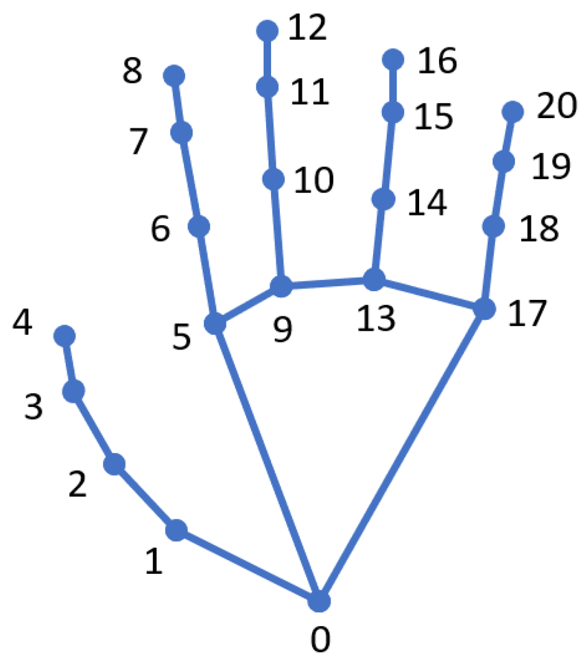

# MediaPipe Live Tracking
Realtime body, hand, and face tracking in the browser using MediaPipe.

<div style="display: flex; gap: 20px; align-items: stretch;">
  
  
</div>

Real-time **body**, **hand**, and **face** tracking directly in the browser.  
All functionality is implemented using **JavaScript** for logic and **CSS** for styling. No backend or server-side code is required.

---

## How to Use

1. **Clone or download the repository:**
```bash
git clone https://github.com/yourusername/mediapipe-live-tracking.git
cd mediapipe-live-tracking
